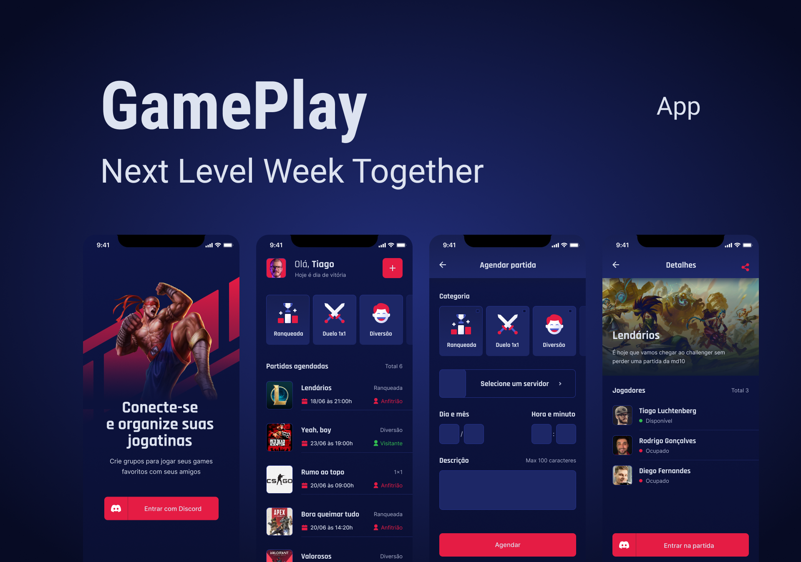

<h1 align=center>

</h1>


<div align=center></div>

<br />

## 🤯 About the project

This project was developed during the Next Level Week Together. It is an app for scheduling gameplays with your frends, with an integration with your Discord account, so you can manage your servers.


<!-- ## Demo

...working on it... -->

## 👨‍💻 Techs

- React Native
- TypeScript
- Expo

## 🚀 How to run

First, make sure to have [Nodejs](https://nodejs.org/en/), [Yarn](https://yarnpkg.com/) and [Expo](https://docs.expo.io/) installed on your machine.

```bash
# clone the repository
git clone https://github.com/lucascprazeres/gameplay-app

# navigate to the project folder
cd gameplay-app

# install the dependencies
yarn

# run the project
expo start
```

with the server running, you may download the app [Expo Go](https://expo.io/client) and scan the QR code presented.

## 😍 How to contribute

**make sure to complete the steps on the previous sections**

then,

```bash
# create a branch of your own
$ git checkout -b <your-branch-name>

# write some code...

# commit your chages
git add . && git commit -m "type(scope): description"

# send them to your fork
git push origin <your-branch-name>
```

**the last step is to create a pull request here on github**

*ps: if you're not familiar with the commit message structure above, please check [this](https://gist.github.com/joshbuchea/6f47e86d2510bce28f8e7f42ae84c716)*

---

<div align=center>
  Made with 💜 by <a href="https://www.linkedin.com/in/lucas-prazeres/">Lucas Prazeres</a>
</div>
